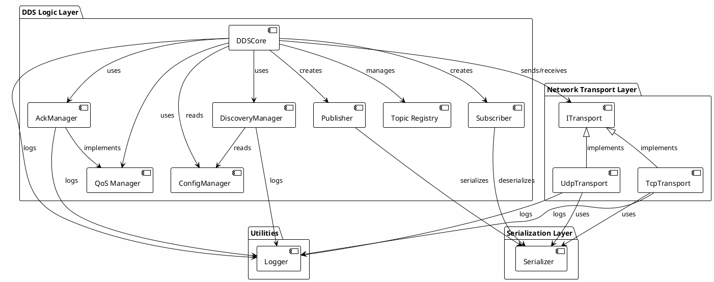
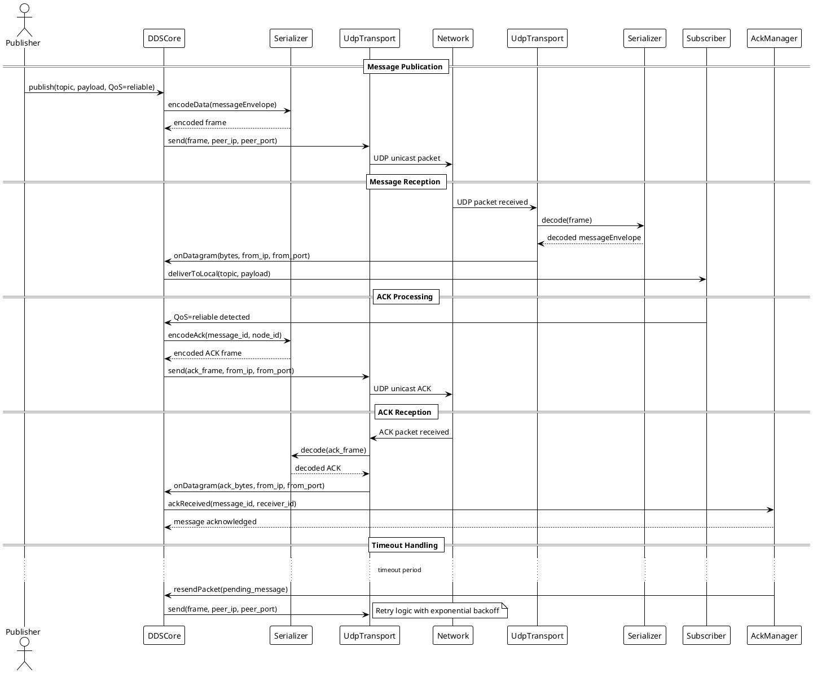
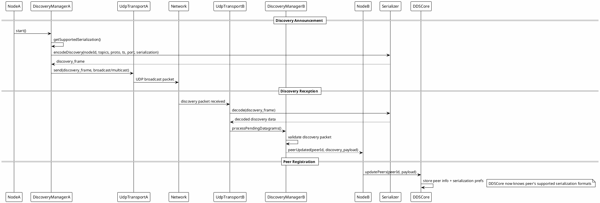

## Architecture

### Component Diagram

### Sequence Diagram - Reliable QoS Message Flow

### Sequence Diagram - Discovery Flow

## Message & Frame Model

- MessageEnvelope: { message_id, topic, qos, timestamp, from_node, payload }.
- Frames: DATA, ACK, DISCOVERY.
- Serialization: JSON (default) or CBOR with per-peer negotiation.

## QoS & Routing

- Best-effort: broadcast to transport.udp.port.
- Reliable: UNICAST to all peers advertising the topic with ACK/retry.

## De-duplication

- Subscriber/DDSCore: bounded LRU for (publisher, topic, message_id), capacity 2048 (configurable via qos.dedup_capacity), evicts oldest on overflow.

## Serialization Negotiation

- Discovery beacons include `serialization` field with supported formats array
- Per-peer format selection: first intersection between local and peer supported lists
- Fallback to JSON if no common format
- Auto-detection on receive: CBOR first, then JSON

## Logging & Categories

- [BOOT], [DISC], [SEND][UNICAST], [SEND][BCAST], [ACK][TX/RX], [RETRY], [GIVEUP], [DEADLETTER], [DROP], [ROUTE][MISS].

## Testing

Unit tests for Serializer, AckManager, and Negotiation verify core functionality:
- Serializer: Validates JSON/CBOR decode for DATA, ACK, DISCOVERY; drops malformed/missing fields.
- AckManager: Tests retry logic (resend on timeout, dead-letter after max retries).
- Negotiation: Tests format selection algorithms and edge cases.

Run via `scripts/test_all.ps1` or CTest.
